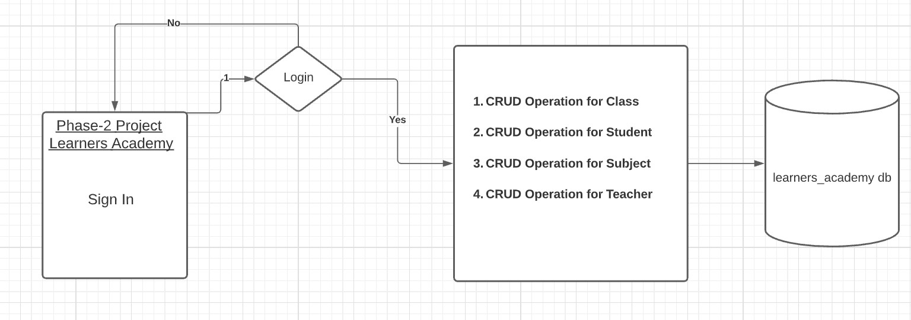

->  1. Phase2 Project Learners Academy 
---
	1.1  Project Description
		1.1.2 Tech stack:	
			-> Java
			-> Servlet
			-> JSP
			-> Exception Handling
			-> HTML
			-> Maven
      			-> Hibernate
      			-> SQL
      			-> Tomcat Server
---
		
-> 2. Process Flow Chart
---

---

-> 2. Project Users Stories : ( Agile and Scrum )
---

	1. As an admin I want to create a class,update a class, delete a class and see(list) the classes that are present.
	2. As an admin I want to create a student,update a student, delete a student and see(list) the students that are present.
	3. As an admin I want to create a teacher,update a teacher, delete a teacher and see(list) the teachers that are present.
	4. As an admin I want to create a subject,update a subject, delete a subject and see(list) the subjects that are present.
	5. As a dev I want to build login page so that we can authenticate the admin.
	6. As a dev create CRUD operations for Class,Student,Subject and Teacher.
  	7. As a dev create a database in SQL.

---

Sprint 1 (8 days)

	1. As an admin I want to create a class,update a class, delete a class and see(list) the classes that are present.
	2. As an admin I want to create a student,update a student, delete a student and see(list) the students that are present.
	3. As an admin I want to create a teacher,update a teacher, delete a teacher and see(list) the teachers that are present.
	4. As an admin I want to create a subject,update a subject, delete a subject and see(list) the subjects that are present.
	5. As a dev I want to build login page so that we can authenticate the admin.
	6. As a dev create CRUD operations for Class,Student,Subject and Teacher.
  	7. As a dev create a database in SQL.
	
---

->3. Project git Repositories ->
---
	1. link : https://github.com/ashishav7/phase-2-project-learners-academy.git
	2. clone git : git clone https://github.com/ashishav7/phase-2-project-learners-academy.git
	

->4. How to run poject:
	
	4.1. Clone Project
		clone git : git clone https://github.com/ashishav7/lockedMe.git
	4.2. Database Creation
    		create a database in MYSQL Workbench with name "learners_academy2"
  	4.3. Modifying "hibernate.cfg.xml"
		change hibernate.connection.username property to the username of the connection username of your SQL connection
		change hibernate.connection.password property to the password of the connection username of your SQL connection
  	4.4. Install Tomcat Server
    		Install the tomcat server9.0
  	4.5. Run Project 
  		right click on project name  -> run as -> Run On Server

-> Source code files

	Directory Structure:
  ---
  
  
  ---
  -----

5. Some Output Screenshots
	
	**Login Screen**
	--- 
	
	---
	**Home Screen**	
	--- 
	
	---
	**Create Class Screen**
	--- 
	
	---
	**Add Class Form** 
	--- 
	
	---
	
	**List**
	---
	
	---
	
	**Update Form**
	---
	
	---
